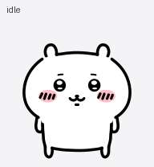

# Chiikawa for Codex Pets

An unofficial Chiikawa companion for Codex.

[](https://codex-pets.net/#/pets/chiikawa-svg)



## Install

```bash
npx codex-pets add chiikawa-svg
```

Or install with curl:

```bash
curl -L "https://codex-pets.net/api/pets/chiikawa-svg/download?v=1791375690150" \
  -o "/tmp/chiikawa-svg.codex-pet.zip" &&
mkdir -p "$HOME/.codex/pets/chiikawa-svg" &&
unzip -o "/tmp/chiikawa-svg.codex-pet.zip" \
  -d "$HOME/.codex/pets/chiikawa-svg"
```

[Build instructions](docs/BUILD.md) · [Design notes (Korean)](docs/BUILD.ko.md) · [Agent guide](AGENTS.md)

Chiikawa was created by Nagano (ナガノ). Unofficial fan project; see the [artwork notice](ARTWORK-NOTICE.txt).
